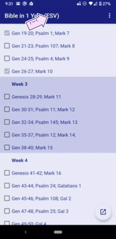
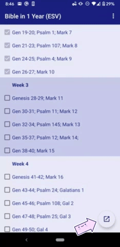
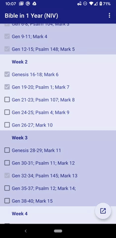
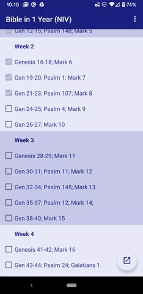
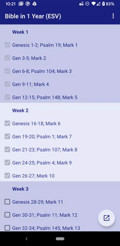

# bibleinayear

This is a simple app to help you read through the bible in 1 year.

To install, goto the link below:

[link](https://github.com/aquagray/bibleinayear/blob/master/app-debug.apk)

Then click download, and install.

Features:

1) Remembers your progress on reading, and you can click the link and goto the bible verse!

2) Change the bible version

3) utmost.org to today's devotional

4) Easy to edit read / not read if you made mistake.

